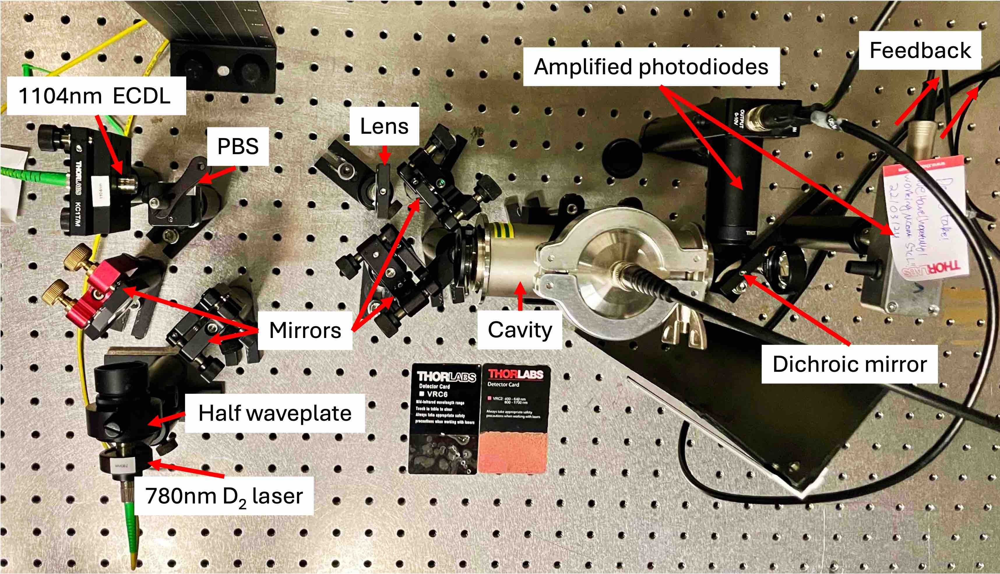
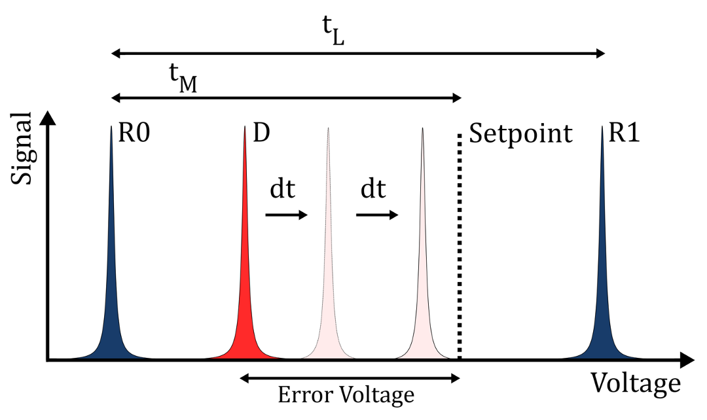

# Scanning transfer cavity lock MSci project
## Ivan Shalashilin and Jacob J. J. Edginton

Writeup tutorial and code of how to use the scanning transfer cavity lock (STCL) for the next
set of students. This readme outlines important knowledge 

# Experimental setup

The STCL setup is as follows (parts list at the end):

0. Set up the optics as in the diagram (except the dichroic)
1. Fibre light from 1104nm and 780nm into fibre collimators
2. Pass 780nm light through half waveplate. Rotate waveplate until it is relfected at the
   polarising beam splitter (PBS)
3. Turn on function generator, amplify the signal, and scan the cavity with a
   sawtooth/triangle wave at $\sim$ 5-15Hz
4. Couple 1104nm into the cavity (alignment tips below), until signal is maximised. Monitor output with amplified
   photodiode on an oscilloscope
5. Align 780nm into the cavity via the PBS
6. Align dichroic mirror and second photodiode to split 780nm onto the second channel

# Peak detection

Once both lasers are aligned, the peak detector boxes need to be set up - these provide
a TTL (digital) pulse for use in locking. This is done as follows:

1. Send each photodiode output into a separate peak detector box
2. Plug preamp monitor and output into scope, adjust the box until signal is desired
   (this step is finnicky)
3. Repeat 2 for diff gain and threshold
4. Change pulse width to desired value (see below)

## Arduino

The Arduino Due takes 4 digital inputs - TTL 780nm, TTL 1104nm, rising and falling edge of
function generator scan trigger, and two digital outputs for feedback to the cavity and
the laser. The Arduino is set up as follows:

(pin values are arbitrary. Choose whatever corresponds to the code/is convenient)

1. Connect the 780nm TTL into pin 50 and the 1104nm TTL into pin 46
2. Split the function gen trigger signal and connect to pin 30 and pin 26
3. Connect the 1104nm feedback to DAC0 and the cavity feedback to DAC1
4. Connect low pass filters (cutoff $\sim$ 1000 Hz) on the analog outputs
5. During operational STCL, combine the amplifed function generator and cavity feedback with the
   voltage summer, then send to cavity
6. Adjust offset on function gen until the cavity is scanning a FSR with an 1104nm peak in
   the middle of two 780nm peaks
7. Run Arduino code

# Arduino algorithm

## High level

Check this paper for a good explanation: [Fast scanning cavity offset lock for laser frequency drift stabilization](https://pubs.aip.org/aip/rsi/article-abstract/81/7/075109/924409/Fast-scanning-cavity-offset-lock-for-laser?redirectedFrom=fulltext)

## Code specifics

This repo contains the STCL file `STCL_CCM_final.ino`, which works as follows:

  `setup()` 
  - 
-  Enables output to the analog pins
-  Enables the serial port for data logging
-  Creates interrupt pins for the rising and falling scan trigger edge 
- Enables the input to digital pins for 780nm and 1104nm
- Updates `time_previous` to the current time using `micros()`

`enable_input()` and `disable_input()`
  - 
- Interrupt functions associated with the
  rising and falling edge scan trigger - flip bools in the main loop 

  `loop()`
- 
- The loop begins by waiting until the rising edge, triggering `enable_input()`, which enters into the state
    machine `on_ttl_high`
- The code enters `while(!master_1_found)`, which continuously reads the master pin
    and stays inside the while loop until there is a high signal on the master pin. Once
    this is true, it records the time and flips the bool `master_1_found`
- Previous step is repeated with the bools `slave_1_found` and `master_2_found`

- Once all 3 peaks have been found, the code computes a PID 1104nm laser feedback (see theses for a
  detailed explanation)

-  Next, the code waits for the falling edge interrupt, and computes the cavity PID
   output. Both are then sent at the same time on the
  analog pins to the cavity and 1104nm laser. 

  
  - The loop resets and waits for `enable_input()`

If a peak is missed on the scan, the Arduino loops over the pin until `disable_input()`
is triggered, resetting the loop entirely, and no correction
is made.

# Alignment

Aligning a cavity is an art, not a science. Here are some tips:

1. Place the alignment mirrors as close as possible to the cavity
2. Always use a lens, *before* the alignment mirrors. This way changing the alignment
   doesn't mess with alignment along the lens
3. Use q-parameter software such as GaussianBeam to determine where the lens should go,
   accounting for the first cavity mirror
4. Centre the mirror threads before alignment
5. Coarsely adjust into the cavity by manually moving/rotating the mirrors before using
   the threads
5. Ensure the beams are central on the face to avoid clipping
6. Always lens the signal onto the photodiode

In his thesis, John Barry mentions an iterative method of aligning which involves
changing the mirror length. We didn't do it this way but reading his thesis may be useful.

# Data acquistion (DAQ)

Data logging was used extensively in the project. To monitor cavity signal, we used a
PXIe and NI DAQs interfaced by Labview. In the folder 

# Parts list 

## Cavity
 
- Cavity mirrors - [Layertec laser mirror 103950](https://www.layertec.de/en/shop/datasheet-103950/?cur=USD)
- KF-50 vacuum casing
- PZT actuator – [Noliac NAC2123](https://www.mmech.com/images/stories/Standard_Products/Noliac_Actuators/Ring_Actuators/NAC2123.pdf)

## Electronics

- Voltage summer (homebuilt)
- Function generator
- Amplifiers
- Lowpass filters (homebuilt)
- Electro optical modulator (EOM, homebuilt)
- Arduino Due microcontroller
- PXIe data acquistion box
- **Amplified** photodiodes x 2 
- Peak detector boxes (homebuilt, find these in Blackett bay 1)

## Optics

- 780nm D2 Rb laser
- 1104nm ECDL laser
- Broadband mirrors x 4 – [Thorlabs BB1-EO3](https://www.thorlabs.com/thorproduct.cfm?partnumber=BB1-E03)
- Fibre collimtors x 2 – [Thorlabs
  F280APC-C](https://www.thorlabs.com/thorproduct.cfm?partnumber=F280APC-C) (one of them
  may be B coated rather than C)
- Polarising beam splitter
- f=150mm B coated lens (subject to change) – [Thorlabs LA1433-B](https://www.thorlabs.com/thorproduct.cfm?partnumber=LA1433-B)
- Half waveplate
- Dichroic mirror – [Thorlabs DMLP950](https://www.thorlabs.com/thorproduct.cfm?partnumber=DMLP950)
- Lenses for photodiodes (short focal length) x 2  

## Thermo 

- Varyac (find these in Blackett)
- Thermocouples
- NI Thermocouple DAQ
- Insulating foil
